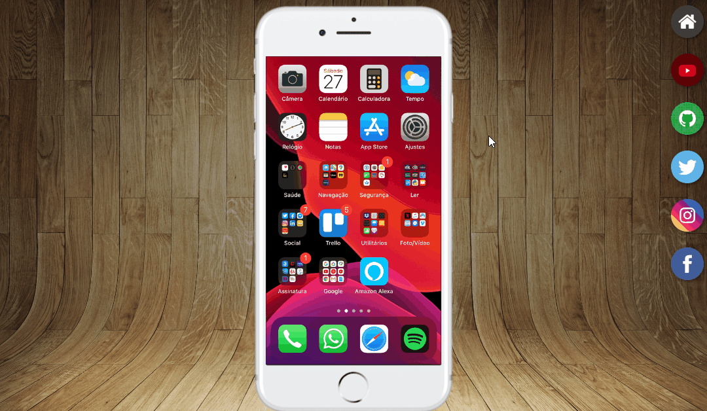

# 📱 **Projeto Redes Sociais**
O projeto das Redes Sociais trata-se de um site na qual abordará as minhas redes sociais pessoais, utilizando HTML e CSS, na qual foi ensinado no curso de HTML5 e CSS3 do [CursoEmVideo](https://www.cursoemvideo.com/).

\
ㅤ
## 🍈 **Tecnologias Utilizadas**

- HTML5
- CSS3
\
ㅤ
## 📌 **Como mexer**

Basicamente, é um site simples com apenas uma página que mostra um celular (responsivo) e alguns botões na parte direita que são funcionais, além disso o site utiliza iframes para páginas internas que dão acesso as minhas redes sociais.

\
ㅤ
## 😛 **Autor do Projeto**

O projeto foi desenvolvido pelo [Gustavo Guanabara](https://github.com/gustavoguanabara) e recriado por [Reed0ne](https://github.com/Reed0ne), com objetivo educacional.

\
ㅤ
### ***Observações Finais***

ATENÇÃO: ***O projeto redes sociais, tem como principal objetivo o estudo de HTML e CSS, principalmente aplicando os iframes e a responsividade no mesmo.***

--Reed0ne--
